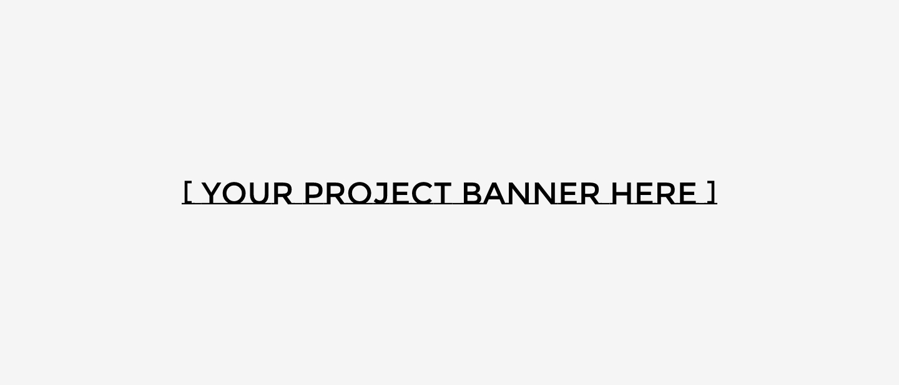

<h1 align="center">
    
</h1>

<h1 align="center">
  <a href="#"> PROJECT NAME HERE </a>
</h1>

<h3 align="center">We help you build your project in React!</h3>

<p align="center">

  
  
  <a href="https://github.com/evelinsteiger/README-template">
    
  </a>
    
  

  <a href="https://github.com/evelinsteiger/">
    
  </a>
</p>

<h4 align="center"> 
	 Status: Finished
</h4>

<p align="center">
 <a href="#about">About</a> •
 <a href="#features">Features</a> •
 <a href="#how-it-works">How it works</a> • 
 <a href="#tech-stack">Tech Stack</a> •  
 <a href="#author">Author</a> • 
 <a href="#user-content-license">License</a>
</p>

## About

PROJECT - Is a way to help build a new project in React using a folder structure and pre-assembled and customized components.

<!-- Project developed by ** Vest Surf Team ** offered by [Vest Surf](https://www.vestsurf.com/). -->

---

## Features

- [x] Users will be able to access via token
- [x] Packages can be registered on the web platform by sending:
  - [x] title
  - [x] description

---

## How it works

The project is divided into two parts:

1. Backend (another repo)
2. Frontend (this repo)

But this repository is referring only to the Frontend part. Frontend need the Backend to be running to work.

### Pre-requisites

Before you begin, you will need to have the following tools installed on your machine:
[Git] (https://git-scm.com), [Node.js] (https://nodejs.org/en/).
In addition, it is good to have an editor to work with the code like [VSCode] (https://code.visualstudio.com/)

#### Running the web application (Frontend)

```bash

# Clone this repository
$ git clone git@github.com: evelinsteiger / README-template.git

# Access the project folder in your terminal
$ cd README-template

# Install the dependencies
$ yarn

# Run the application in development mode
$ yarn start

# The application will open on the port: 3000 - go to http://localhost:3000

```

---

## Tech Stack

The following tools were used in the construction of the project:

#### **Platform** ([React](https://reactjs.org/) + [TypeScript](https://www.typescriptlang.org/))

- **[React Router Dom](https://github.com/ReactTraining/react-router/tree/master/packages/react-router-dom)**
- **[React Icons](https://react-icons.github.io/react-icons/)**
- **[Axios](https://github.com/axios/axios)**
- **[Leaflet](https://react-leaflet.js.org/en/)**
- **[React Leaflet](https://react-leaflet.js.org/)**
- **[React Redux](https://github.com/reduxjs/react-redux)**
- **[AntDesign](https://ant.design/)**
- **[react-device-detect](https://github.com/duskload/react-device-detect)**
- **[moment.js](https://momentjs.com/)**
- **[Bootstrap](https://getbootstrap.com/)**
- **[sass](https://github.com/sass/dart-sass)**
- **[Styled Components](https://github.com/styled-components/styled-components)**

> See the file [package.json](https://github.com/evelinsteiger/README-template/blob/master/package.json)

#### [](#)**Utilitários**

- API: **[IBGE API](https://servicodados.ibge.gov.br/api/docs/localidades?versao=1)** → **[API de UFs](https://servicodados.ibge.gov.br/api/docs/localidades?versao=1#api-UFs-estadosGet)**, **[API de Municípios](https://servicodados.ibge.gov.br/api/docs/localidades?versao=1#api-Municipios-estadosUFMunicipiosGet)**
- Maps: **[Leaflet](https://react-leaflet.js.org/en/)**
- Editor: **[Visual Studio Code](https://code.visualstudio.com/)**
- Icons: **[Feather Icons](https://feathericons.com/)**, **[Font Awesome](https://fontawesome.com/)**
- Fonts: **[Ubuntu](https://fonts.google.com/specimen/Ubuntu)**, **[Roboto](https://fonts.google.com/specimen/Roboto)**

---

## Author

<a href="https://blog.rocketseat.com.br/author/thiago/">
 
 <br />
 <sub><b>Evelin Steiger</b></sub></a>
 <br />

[](https://www.linkedin.com/in/evelinsteiger/)
[](mailto:evelinsteiger1@gmail.com)

---

## License

This project is under the license [MIT](./LICENSE).

Made with love by Evelin Steiger 👋🏽 [Get in Touch!](https://www.linkedin.com/in/evelinsteiger/)

---

## Learn More

This project was created and bootstrapped with [Create React App](https://github.com/facebook/create-react-app).

You can learn more in the [Create React App documentation](https://facebook.github.io/create-react-app/docs/getting-started).

To learn React, check out the [React documentation](https://reactjs.org/).
